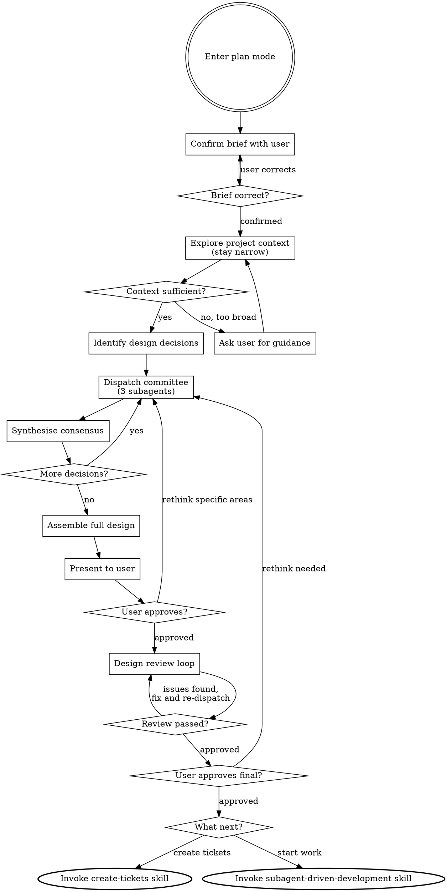

# Agent Committee Brainstorming

Turn ideas into fully formed designs through autonomous multi-agent deliberation. The user provides the initial idea, then a committee of 3 subagents explores, debates, and converges on design decisions without user involvement until the final design is ready for review.

<HARD-GATE>
Do NOT invoke any implementation skill, write any code, scaffold any project, or take any implementation action until you have presented a design and the user has approved it. This applies to EVERY project regardless of perceived simplicity.
</HARD-GATE>

## How This Differs From Brainstorming

Regular brainstorming asks the user one question at a time to refine the design. Committee brainstorming replaces that interactive loop with autonomous deliberation:

- **No clarifying questions to the user** - the committee debates and decides
- **Three perspectives** - each committee member brings a different lens to every decision
- **Consensus-driven** - decisions require agreement, not a single opinion
- **User reviews the output** - the user sees the finished design, not the process

The output is the same: a reviewed design that flows into either create-tickets or subagent-driven-development.

## Why Plan Mode

Plan mode is the native environment for committee brainstorming. It provides:

- **Read-only safety** - you can explore the codebase freely but cannot write code, create files, or take implementation actions. The hard gate enforces itself.
- **Coordination space** - the orchestrator needs room to synthesise committee outputs without accidentally modifying anything.
- **No stale artefacts** - the design lives in the conversation context and flows directly into planning.

## Checklist

You MUST enter plan mode (use `{{ENTER_PLAN_TOOL}}`) before committee brainstorming.

You MUST create a task (using `{{TASK_TRACKER_TOOL}}`) for each of these items and complete them in order:

1. **Confirm the brief** - restate what the user wants to build, ask if anything is missing or wrong (this is the ONLY question asked of the user)
2. **Explore project context** - check files, docs, recent commits
3. **Identify design decisions** - list the key decisions that need to be made
4. **Committee deliberation rounds** - for each decision or group of related decisions, dispatch the committee and synthesise consensus
5. **Assemble design** - combine all consensus decisions into a coherent design
6. **Present design** - present the full design to the user for approval
7. **Design review loop** - dispatch design-reviewer subagent against the summary; fix issues and re-dispatch until approved (max three iterations, then surface to human)
8. **User approves final design** - present the reviewed design summary, get explicit user approval
9. **Decide next step** - use `{{ASK_USER_TOOL}}` to ask what to do next (see Next Steps below)

## Process Flow



**The terminal states are create-tickets or subagent-driven-development.** After committee brainstorming, the only skills you invoke are create-tickets (to track work as tickets) or subagent-driven-development (to start building). When create-tickets is chosen, the design is embedded in the epic body so that work-on-ticket can recover it in a future session.

## The Process

### Phase 1: Confirm the Brief

This is the only point where you ask the user a question. Restate their request in your own words, including:

- What you understand they want to build
- The scope as you see it
- Any assumptions you are making

Use `{{ASK_USER_TOOL}}` to confirm:

```
{{ASK_USER_TOOL}}:
  question: "[Your restatement of the brief]. Is this correct, or would you like to adjust anything before the committee begins?"
  header: "Confirming the brief"
```

Once confirmed, the user is hands-off until the design is ready for review.

### Phase 2: Explore Project Context

Silently explore the codebase, but stay focused on what the brief requires. Everything gathered here gets passed to every committee member in every round, so unnecessary context dilutes focus and wastes capacity.

**Start narrow:**
- Directory structure and key entry points relevant to the brief
- Existing code that directly relates to the proposed feature
- Patterns used in the areas the feature will touch
- Testing patterns and conventions in those same areas

**Do not exhaustively map the entire codebase.** Only explore subsystems the feature will interact with.

**Self-assess after the initial pass:** Can you identify the key design decisions and the relevant code? If yes, move to Phase 3. If the feature touches more than 3 subsystems, or you cannot confidently determine what code is relevant, surface what you have found to the user using `{{ASK_USER_TOOL}}` and ask for guidance on where to focus. This is the only other point (besides Phase 1) where you may ask the user a question.

This context will be provided to each committee member so they can make informed decisions.

### Phase 3: Identify Design Decisions

Before dispatching the committee, identify the key decisions that need to be made. These typically include:

- **Architecture** - how does this fit into the existing system?
- **Approach** - which of several possible approaches should we take?
- **Data flow** - how does data move through the new components?
- **Error handling** - what failure modes exist and how do we handle them?
- **Testing strategy** - how do we verify this works?
- **Integration** - how does this connect to existing code?

Group related decisions together. Each committee round should address a coherent set of decisions, not individual micro-choices.

### Phase 4: Committee Deliberation

For each decision group, dispatch 3 committee members in parallel using `{{DISPATCH_AGENT_TOOL}}`. Each member receives identical context but brings a different perspective (see committee-member-prompt.md):

1. **The Pragmatist** - prioritises simplicity, maintenance cost, and shipping quickly
2. **The Architect** - prioritises patterns, extensibility, and system design
3. **The Advocate** - prioritises user experience, edge cases, and robustness

Dispatch all 3 in a single message so they run concurrently.

**Subagent type selection:**

Each committee role should use a specialised subagent type rather than `general-purpose`. Specialised agents carry built-in domain knowledge that reinforces the perspective without relying on persona prompts alone.

| Role       | Recommended subagent type            | Rationale                                                        |
|------------|--------------------------------------|------------------------------------------------------------------|
| Pragmatist | Stack-specific developer (see below) | Thinks in terms of what is practical and idiomatic for the stack |
| Architect  | `architect-reviewer`                 | Built for evaluating system design decisions and patterns        |
| Advocate   | `qa-expert`                          | Naturally focuses on quality, edge cases, and robustness         |

**Selecting the Pragmatist type:** During Phase 2 (Explore Project Context), identify the project's primary language and framework. Map this to the most specific available subagent type:

- TypeScript project: `typescript-pro`
- Python project: `python-pro`
- Go project: `golang-pro`
- React frontend: `react-specialist`
- Rust project: `rust-engineer`
- PHP/Laravel: `laravel-specialist` or `php-pro`
- Multi-language or non-code: fall back to `general-purpose`

If the available subagent types do not include a match for a role, fall back to `general-purpose` with the perspective described in the prompt template.

**Context each member receives:**
- The user's brief
- Relevant codebase context (file structures, patterns, existing code)
- The specific decisions being asked about
- Decisions already made in previous rounds (if any)

**Each member returns:**
- Their recommendation for each decision
- Their reasoning
- Any concerns or risks they see

### Phase 5: Synthesise Consensus

After each committee round, synthesise the results:

| Outcome        | Action                                                             |
|----------------|--------------------------------------------------------------------|
| All 3 agree    | Take that approach                                                 |
| 2 of 3 agree   | Take the majority view, note the dissenting concern if substantive |
| All 3 disagree | Pick the most pragmatic option, note alternatives briefly          |

**Concerns flagged by 2+ members must be addressed** in the design, even if the specific recommendation differs.

If a round produces a split with genuinely irreconcilable trade-offs (not just preference differences), dispatch a single tiebreaking round where all 3 members see each other's positions and must converge.

Record the consensus for each decision group before moving to the next round.

### Phase 6: Assemble the Design

Combine all consensus decisions into a coherent design summary:

- **Goal** - what we are building and why
- **Architecture** - how it fits into the existing system
- **Components** - what the key pieces are and what each does
- **Interfaces** - how components communicate
- **Data flow** - how data moves through the system
- **Error handling** - failure modes and recovery
- **Testing strategy** - how we verify correctness
- **Integration points** - where this touches existing code

Scale each section to its complexity. A simple feature gets a simple design.

### Design for Isolation and Clarity

Same principles as brainstorming:
- Break into smaller units with one clear purpose and well-defined interfaces
- Each unit: what does it do, how do you use it, what does it depend on?
- Prefer smaller, focused files over large ones

### Working in Existing Codebases

Same principles as brainstorming:
- Follow existing patterns
- Where existing code has problems that affect the work, include targeted improvements
- Do not propose unrelated refactoring

## Committee Member Guidelines

Each committee member uses a specialised subagent type that reinforces its perspective (see Phase 4 for type selection). The prompt template in committee-member-prompt.md provides the decision context; the subagent type provides the domain expertise.

**Key rules for committee members:**
- Use specialised subagent types where available (see Phase 4 table); fall back to `general-purpose` only when no match exists
- They receive the codebase context, not session history
- They must justify recommendations with specific reasoning
- They must flag concerns even when recommending an approach
- They must stay within scope (do not redesign unrelated systems)
- They can read the codebase to verify assumptions

## Design Review Loop

After assembling the design, dispatch a design-reviewer subagent to catch holistic issues that the committee process may have missed. Provide the subagent with the full design summary text (never your session history).

The reviewer checks for:

| Category     | What to Look For                                                               |
|--------------|--------------------------------------------------------------------------------|
| Completeness | Gaps, undefined behaviour, missing sections                                    |
| Consistency  | Contradictions between sections, conflicting requirements                      |
| Clarity      | Requirements ambiguous enough to cause someone to build the wrong thing        |
| Scope        | Focused enough for a single plan, not covering multiple independent subsystems |
| YAGNI        | Unrequested features, over-engineering                                         |

**Calibration:** Only flag issues that would cause real problems during implementation planning. A contradiction, a missing component, or a requirement so ambiguous it could be interpreted two different ways are issues. Minor wording improvements, stylistic preferences, and "sections less detailed than others" are not.

**Process:**

1. Dispatch design-reviewer subagent using `{{DISPATCH_AGENT_TOOL}}` (see `../brainstorming/design-reviewer-prompt.md`)
2. If issues are found: fix the design summary and re-dispatch
3. Repeat until approved (max three iterations, then surface to human for guidance)

After the review loop passes, present the final design summary to the user and get explicit approval before proceeding. If the user requests changes, feed those changes back into a targeted committee round, then re-run the review loop.

## Presenting to the User

When presenting the design, include:

- The full design summary
- A brief note on any decisions where the committee was split, with the reasoning for the chosen direction
- Any risks or trade-offs the committee flagged

Do NOT present the full deliberation transcripts. The user wants the result, not the process. If they ask about a specific decision, you can explain the committee's reasoning.

## Next Steps

Once the user approves the reviewed design, use `{{ASK_USER_TOOL}}` to determine next steps. Do NOT ask as plain text.

```
{{ASK_USER_TOOL}}:
  question: "Would you like to create tickets for this work, or start implementation now?"
  header: "Next step"
  options:
    - label: "Create tickets"
      description: "Break the design into tracked tickets. Good when work isn't happening right now, needs tracking, or involves multiple people."
    - label: "Start implementation"
      description: "Begin building now using subagent-driven development."
  multiSelect: false
```

**Create tickets:** Use `{{INVOKE_SKILL_TOOL}}` to invoke the create-tickets skill. The full design is embedded in the epic body so that work-on-ticket can recover it in a future session.

**Start implementation:** Use `{{INVOKE_SKILL_TOOL}}` to invoke the subagent-driven-development skill. This decomposes the design into tasks and executes them with subagents.

Do NOT invoke any other skill. The only downstream skills are create-tickets or subagent-driven-development.

## Anti-Pattern: "This Is Too Simple For a Committee"

If the project is genuinely trivial (a single config change, a one-line fix), regular brainstorming is the right tool. Committee brainstorming is for projects with real design decisions. If there are fewer than 2 meaningful decisions to make, suggest brainstorming instead.

Conversely, if the project is too large for a single design (multiple independent subsystems), help the user decompose into subprojects first, then committee-brainstorm the first one.

## Key Principles

- **User provides the brief, committee does the work** - minimise user involvement until review
- **Three perspectives, one design** - diversity of viewpoint produces better decisions
- **Consensus over authority** - 2+ members agreeing carries weight
- **Concerns are signal** - if multiple members flag a risk, address it
- **YAGNI ruthlessly** - the committee should not gold-plate; remove unnecessary features
- **Transparent reasoning** - the user can ask why any decision was made
- **Design in dialogue** - the committee deliberates, the orchestrator synthesises
