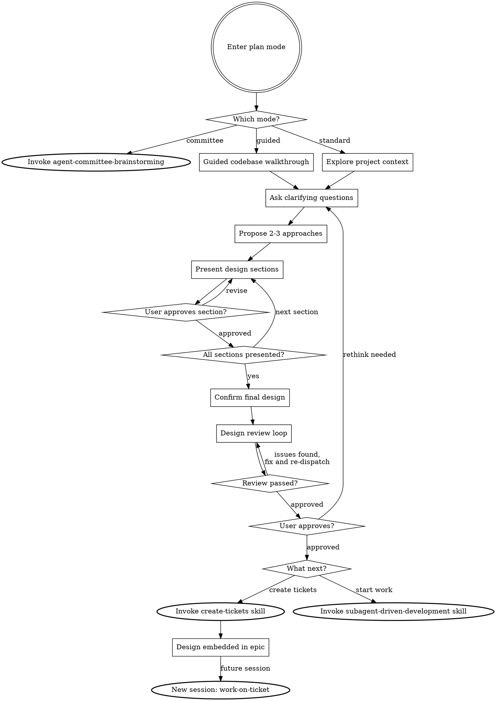

# Brainstorming Ideas Into Designs

Help turn ideas into fully formed designs through natural collaborative dialogue using plan mode.

Start by understanding the current project context, then ask questions one at a time to refine the idea. Once you understand what you're building, present the design and get user approval. The design lives in the conversation, not in files.

<HARD-GATE>
Do NOT invoke any implementation skill, write any code, scaffold any project, or take any implementation action until you have presented a design and the user has approved it. This applies to EVERY project regardless of perceived simplicity.
</HARD-GATE>

## Anti-Pattern: "This Is Too Simple To Need A Design"

Every project needs design review, however brief. Simple projects get simple designs. Always present and get approval.

## Why Plan Mode

Plan mode is the native environment for brainstorming. Read-only safety enforces the hard gate, iterative refinement makes the conversation the design medium, and no stale artefacts means no spec files to maintain.

## Checklist

You MUST enter plan mode (use `{{ENTER_PLAN_TOOL}}`) before brainstorming.

### Stage 1: Mode Selection

Create a single task using `{{TASK_TRACKER_TOOL}}`:

1. **Offer mode selection** - use `{{ASK_USER_TOOL}}` to ask which brainstorming mode the user wants (see Offering Mode Selection below). If the user selects agent committee, invoke the agent-committee-brainstorming skill using `{{INVOKE_SKILL_TOOL}}` and stop. If the user selects standard or guided, continue to Stage 2. Guided mode follows the same process with teaching additions (see Guided Mode section).

### Stage 2: Brainstorming

Create tasks (using `{{TASK_TRACKER_TOOL}}`) for each of these items and complete them in order:

1. **Explore project context** - check files, docs, recent commits. In guided mode: present as a structured walkthrough (see Guided Mode).
2. **Ask clarifying questions** - one at a time, understand purpose/constraints/success criteria
3. **Propose 2-3 approaches** - with trade-offs and your recommendation
4. **Present design** - in sections scaled to their complexity, get user approval after each section
5. **Confirm final design** - summarise the agreed design in a structured message
6. **Design review loop** - dispatch design-reviewer subagent against the summary; fix issues and re-dispatch until approved (max three iterations, then surface to human)
7. **User approves final design** - present the reviewed design summary, get explicit user approval
8. **Decide next step** - use `{{ASK_USER_TOOL}}` to ask what to do next (see Next Steps below)

## Process Flow



**The terminal states are create-tickets or subagent-driven-development.** After brainstorming, the only skills you invoke are create-tickets (to track work as tickets) or subagent-driven-development (to start building). When create-tickets is chosen, the design is embedded in the epic body so that work-on-ticket can recover it in a future session.

## The Process

**Understanding the idea:**

- Check out the current project state first, but stay focused on the areas relevant to the user's request. Do not exhaustively map the entire codebase.
- Before asking detailed questions, assess scope: if the request describes multiple independent subsystems, flag this immediately. If the project is too large for a single design, help the user decompose into subprojects first.
- If after initial exploration the feature touches more areas than expected (more than ~3 subsystems) and you are uncertain which parts are relevant, tell the user and ask for guidance.
- Ask questions one at a time to refine the idea
- Prefer multiple choice questions when possible
- Only one question per message
- Focus on understanding: purpose, constraints, success criteria

**Exploring approaches:**

- Propose 2-3 different approaches with trade-offs
- Lead with your recommended option and explain why

**Presenting the design:**

- Scale each section to its complexity: a few sentences if straightforward, up to 200-300 words if nuanced
- Ask after each section whether it looks right so far
- Cover: architecture, components, data flow, error handling, testing
- Break into smaller units with one clear purpose and well-defined interfaces
- In existing codebases: follow existing patterns, include targeted improvements where they serve the current goal, don't propose unrelated refactoring

## Guided Mode

When the user selects guided mode, the same process applies with these additions at each phase. The goal is to teach the developer about the codebase as they design, building their mental model alongside the design.

**Communication principles:**

- **Show your working** - when you read files, explain what you found and why it matters
- **Name the patterns** - when the codebase follows a pattern, name it and explain it
- **Surface conventions** - don't assume the user knows how things are done here
- **Invite questions** - after explaining something, ask if anything needs deeper exploration

**Phase 1: Guided codebase walkthrough** (replaces silent exploration)

Present what you find in a structured way, focused on the areas relevant to the brief:

- How the project is organised (directory structure, key entry points)
- Patterns in use and why (e.g. MVC, event-driven, plugin architecture)
- Relevant subsystems: which parts relate to what's being built, how they interact
- Conventions in the relevant areas: naming, testing approach, error handling

After each section, ask: "Does this make sense? Anything you'd like me to dig deeper into?"

**Phase 2: Contextualised questions**

Each question references what you found in the codebase:

- "The codebase uses the repository pattern for data access. Should we follow that here?"
- "There are two existing API response patterns. Which should this feature follow?"

**Phase 3: Contextualised approaches**

Proposals reference existing code:

- "Option A follows the existing pattern in `src/services/`, path of least resistance"
- "Option B introduces a new pattern. The trade-off is inconsistency until migration"

## Confirming the Final Design

Once all design sections have been presented and approved individually, summarise the complete agreed design in a single, structured message. Include: goal, architecture, key components, interfaces, data flow, and anything else that emerged. This summary becomes the input for both the design review loop and the next step.

## Design Review Loop

After consolidating the design summary, dispatch a design-reviewer subagent to catch holistic issues that incremental approval may miss. Provide the subagent with the full design summary text (never your session history).

The reviewer checks for:

| Category     | What to Look For                                                               |
|--------------|--------------------------------------------------------------------------------|
| Completeness | Gaps, undefined behaviour, missing sections                                    |
| Consistency  | Contradictions between sections, conflicting requirements                      |
| Clarity      | Requirements ambiguous enough to cause someone to build the wrong thing        |
| Scope        | Focused enough for a single plan, not covering multiple independent subsystems |
| YAGNI        | Unrequested features, over-engineering                                         |

**Calibration:** Only flag issues that would cause real problems during implementation planning.

**Process:**

1. Dispatch design-reviewer subagent using `{{DISPATCH_AGENT_TOOL}}` (see design-reviewer-prompt.md)
2. If issues are found: fix the design summary and re-dispatch
3. Repeat until approved (max three iterations, then surface to human for guidance)

After the review loop passes, present the final design summary to the user and get explicit approval before proceeding.

## Offering Mode Selection

At the start of brainstorming, use `{{ASK_USER_TOOL}}` to determine which mode the user wants. Do NOT ask as plain text.

```
{{ASK_USER_TOOL}}:
  question: "How would you like to approach this brainstorming session?"
  header: "Mode"
  options:
    - label: "Standard brainstorming"
      description: "I know the codebase. Let's focus on reaching a design efficiently."
    - label: "Guided brainstorming"
      description: "Walk me through the architecture, patterns, and conventions as we go."
    - label: "Agent committee brainstorming"
      description: "Hands-off: 3 AI agents deliberate and reach consensus. I'll review the final design."
  multiSelect: false
```

If the user selects "Guided brainstorming", continue to Stage 2 with guided mode active (see Guided Mode section).

If the user selects "Agent committee brainstorming", invoke the agent-committee-brainstorming skill using `{{INVOKE_SKILL_TOOL}}` and stop.

## Next Steps

Once the user approves the reviewed design, use `{{ASK_USER_TOOL}}` to determine next steps. Do NOT ask as plain text.

```
{{ASK_USER_TOOL}}:
  question: "Would you like to create tickets for this work, or start implementation now?"
  header: "Next step"
  options:
    - label: "Create tickets"
      description: "Break the design into tracked tickets. Good when work isn't happening right now, needs tracking, or involves multiple people."
    - label: "Start implementation"
      description: "Begin building now using subagent-driven development."
  multiSelect: false
```

**Create tickets:** Use `{{INVOKE_SKILL_TOOL}}` to invoke the create-tickets skill.

**Start implementation:** Use `{{INVOKE_SKILL_TOOL}}` to invoke the subagent-driven-development skill.

Do NOT invoke any other skill. The only downstream skills are create-tickets or subagent-driven-development.

## Key Principles

- **One question at a time** - Don't overwhelm with multiple questions
- **Multiple choice preferred** - Easier to answer than open-ended when possible
- **YAGNI ruthlessly** - Remove unnecessary features from all designs
- **Explore alternatives** - Always propose 2-3 approaches before settling
- **Incremental validation** - Present design, get approval before moving on
- **Design in dialogue** - The conversation is the design medium, not a file
