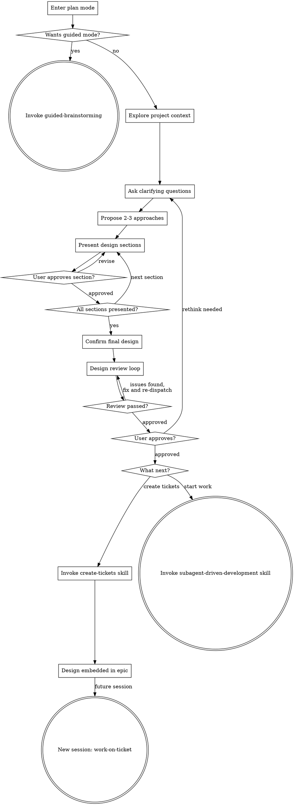

# Brainstorming Ideas Into Designs

Help turn ideas into fully formed designs through natural collaborative dialogue using plan mode.

Start by understanding the current project context, then ask questions one at a time to refine the idea. Once you understand what you're building, present the design and get user approval. The design lives in the conversation, not in files.

<HARD-GATE>
Do NOT invoke any implementation skill, write any code, scaffold any project, or take any implementation action until you have presented a design and the user has approved it. This applies to EVERY project regardless of perceived simplicity.
</HARD-GATE>

## Anti-Pattern: "This Is Too Simple To Need A Design"

Every project goes through this process. A todo list, a single-function utility, a config change, all of them. "Simple" projects are where unexamined assumptions cause the most wasted work. The design can be short (a few sentences for truly simple projects), but you MUST present it and get approval.

## Why Plan Mode

Plan mode is the native environment for brainstorming. It provides:

- **Read-only safety** - you can explore the codebase freely but cannot write code, create files, or take implementation actions. The hard gate enforces itself.
- **Iterative refinement** - the conversation IS the design medium. Each exchange refines the design with the user reviewing in real time.
- **No stale artefacts** - the design lives in the conversation context and flows directly into planning. No spec files to maintain or that drift from reality.

## Checklist

You MUST enter plan mode (use `{{ENTER_PLAN_TOOL}}`) before brainstorming.

You MUST create a task (using `{{TASK_TRACKER_TOOL}}`) for each of these items and complete them in order:

1. **Offer guided mode** - use `{{ASK_USER_TOOL}}` to ask whether the user wants guided or standard brainstorming (see Offering Guided Mode below). If the user wants the guided version, invoke the guided-brainstorming skill using `{{INVOKE_SKILL_TOOL}}` and stop. Otherwise, continue.
2. **Explore project context** - check files, docs, recent commits
3. **Ask clarifying questions** - one at a time, understand purpose/constraints/success criteria
4. **Propose 2-3 approaches** - with trade-offs and your recommendation
5. **Present design** - in sections scaled to their complexity, get user approval after each section
6. **Confirm final design** - summarise the agreed design in a structured message
7. **Design review loop** - dispatch design-reviewer subagent against the summary; fix issues and re-dispatch until approved (max three iterations, then surface to human)
8. **User approves final design** - present the reviewed design summary, get explicit user approval
9. **Decide next step** - use `{{ASK_USER_TOOL}}` to ask what to do next (see Next Steps below)

## Process Flow



**The terminal states are create-tickets or subagent-driven-development.** After brainstorming, the only skills you invoke are create-tickets (to track work as tickets) or subagent-driven-development (to start building). When create-tickets is chosen, the design is embedded in the epic body so that work-on-ticket can recover it in a future session.

## The Process

**Understanding the idea:**

- Check out the current project state first (files, docs, recent commits)
- Before asking detailed questions, assess scope: if the request describes multiple independent subsystems (e.g. "build a platform with chat, file storage, billing, and analytics"), flag this immediately. Don't spend questions refining details of a project that needs to be decomposed first.
- If the project is too large for a single design, help the user decompose into subprojects: what are the independent pieces, how do they relate, what order should they be built? Then brainstorm the first subproject through the normal design flow. Each subproject gets its own design, plan, and implementation cycle.
- For appropriately scoped projects, ask questions one at a time to refine the idea
- Prefer multiple choice questions when possible, but open-ended is fine too
- Only one question per message - if a topic needs more exploration, break it into multiple questions
- Focus on understanding: purpose, constraints, success criteria

**Exploring approaches:**

- Propose 2-3 different approaches with trade-offs
- Present options conversationally with your recommendation and reasoning
- Lead with your recommended option and explain why

**Presenting the design:**

- Once you believe you understand what you're building, present the design
- Scale each section to its complexity: a few sentences if straightforward, up to 200-300 words if nuanced
- Ask after each section whether it looks right so far
- Cover: architecture, components, data flow, error handling, testing
- Be ready to go back and clarify if something doesn't make sense

**Design for isolation and clarity:**

- Break the system into smaller units that each have one clear purpose, communicate through well-defined interfaces, and can be understood and tested independently
- For each unit, you should be able to answer: what does it do, how do you use it, and what does it depend on?
- Can anyone understand what a unit does without reading its internals? Can you change the internals without breaking consumers? If not, the boundaries need more work.
- Smaller, well-bounded units are also easier for you to work with - you reason better about code you can hold in context at once, and your edits are more reliable when files are focused. When a file grows large, that's often a signal that it's doing too much.

**Working in existing codebases:**

- Explore the current structure before proposing changes. Follow existing patterns.
- Where existing code has problems that affect the work (e.g. a file that's grown too large, unclear boundaries, tangled responsibilities), include targeted improvements as part of the design - the way a good developer improves the code they're working in.
- Don't propose unrelated refactoring. Stay focused on what serves the current goal.

## Confirming the Final Design

Once all design sections have been presented and approved individually:

- Summarise the complete agreed design in a single, structured message
- Include: goal, architecture, key components, interfaces, data flow, and anything else that emerged from the conversation

This summary becomes the input for both the design review loop and the next step (create-tickets or subagent-driven-development). It does not need to be written to a file because the conversation context carries it forward.

## Design Review Loop

After consolidating the design summary, dispatch a design-reviewer subagent to catch holistic issues that incremental section approval may miss. Provide the subagent with the full design summary text (never your session history).

The reviewer checks for:

| Category     | What to Look For                                                               |
|--------------|--------------------------------------------------------------------------------|
| Completeness | Gaps, undefined behaviour, missing sections                                    |
| Consistency  | Contradictions between sections, conflicting requirements                      |
| Clarity      | Requirements ambiguous enough to cause someone to build the wrong thing        |
| Scope        | Focused enough for a single plan, not covering multiple independent subsystems |
| YAGNI        | Unrequested features, over-engineering                                         |

**Calibration:** Only flag issues that would cause real problems during implementation planning. A contradiction, a missing component, or a requirement so ambiguous it could be interpreted two different ways are issues. Minor wording improvements, stylistic preferences, and "sections less detailed than others" are not.

**Process:**

1. Dispatch design-reviewer subagent using `{{DISPATCH_AGENT_TOOL}}` (see design-reviewer-prompt.md)
2. If issues are found: fix the design summary and re-dispatch
3. Repeat until approved (max three iterations, then surface to human for guidance)

After the review loop passes, present the final design summary to the user and get explicit approval before proceeding. If the user requests changes, make them and re-run the review loop.

## Offering Guided Mode

At the start of brainstorming, use `{{ASK_USER_TOOL}}` to determine whether the user wants guided or standard mode. Do NOT ask as plain text.

```
{{ASK_USER_TOOL}}:
  question: "Are you familiar with this codebase, or would you like me to walk you through the relevant parts as we design?"
  header: "Mode"
  options:
    - label: "Standard brainstorming"
      description: "I know the codebase. Let's focus on reaching a design efficiently."
    - label: "Guided brainstorming"
      description: "Walk me through the architecture, patterns, and conventions as we go."
  multiSelect: false
```

If the user selects "Guided brainstorming", invoke the guided-brainstorming skill using `{{INVOKE_SKILL_TOOL}}` and stop.

## Next Steps

Once the user approves the reviewed design, use `{{ASK_USER_TOOL}}` to determine next steps. Do NOT ask as plain text.

```
{{ASK_USER_TOOL}}:
  question: "Would you like to create tickets for this work, or start implementation now?"
  header: "Next step"
  options:
    - label: "Create tickets"
      description: "Break the design into tracked tickets. Good when work isn't happening right now, needs tracking, or involves multiple people."
    - label: "Start implementation"
      description: "Begin building now using subagent-driven development."
  multiSelect: false
```

**Create tickets:** Use `{{INVOKE_SKILL_TOOL}}` to invoke the create-tickets skill. The full design is embedded in the epic body so that work-on-ticket can recover it in a future session.

**Start implementation:** Use `{{INVOKE_SKILL_TOOL}}` to invoke the subagent-driven-development skill. This decomposes the design into tasks and executes them with subagents.

Do NOT invoke any other skill. The only downstream skills are create-tickets or subagent-driven-development.

## Key Principles

- **One question at a time** - Don't overwhelm with multiple questions
- **Multiple choice preferred** - Easier to answer than open-ended when possible
- **YAGNI ruthlessly** - Remove unnecessary features from all designs
- **Explore alternatives** - Always propose 2-3 approaches before settling
- **Incremental validation** - Present design, get approval before moving on
- **Be flexible** - Go back and clarify when something doesn't make sense
- **Design in dialogue** - The conversation is the design medium, not a file
