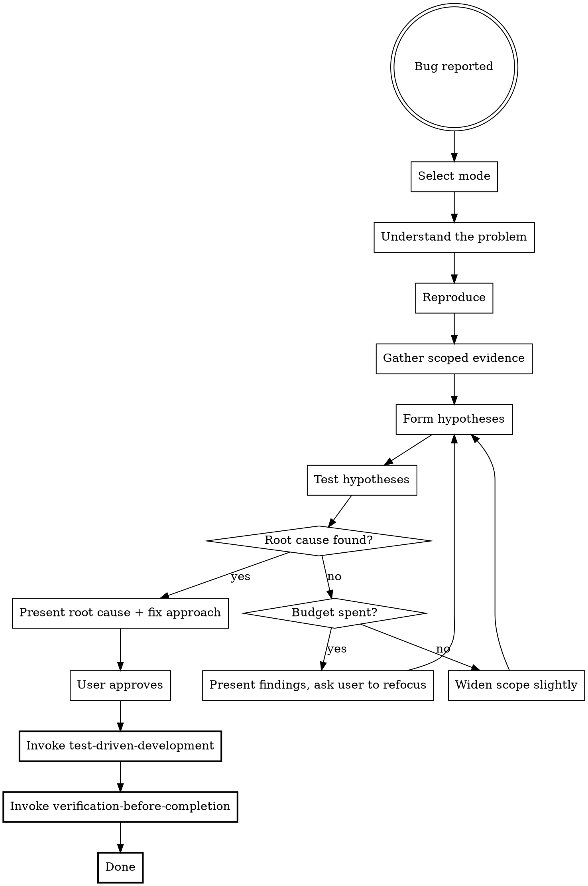

# Debugging

A disciplined, evidence-driven approach to finding and fixing bugs. Prevents shotgun debugging, unfocused investigation, and symptom-level fixes.

## Hard Gate

Do NOT attempt any fix until you have:

1. Reproduced the bug (or confirmed it cannot be reproduced and adjusted approach)
2. Identified the root cause with supporting evidence

This applies to every bug regardless of how obvious it seems. "I can see the problem" is not evidence. Running code and observing failure is evidence.

## Why This Matters

LLMs are drawn to shotgun debugging, changing code based on pattern-matching against error messages without understanding causation. This produces fixes that mask symptoms while leaving the root cause intact, introduce regressions by changing code that wasn't actually broken, and waste time when the first guess is wrong with no systematic approach to fall back on.

Disciplined debugging is: reproduce, gather evidence, hypothesise, test, confirm root cause, then fix.

## Mode Selection

At the start, determine the debugging mode. If the user hasn't indicated a preference, select based on context:

| Mode              | When                                                                       | User involvement                                          |
| ----------------- | -------------------------------------------------------------------------- | --------------------------------------------------------- |
| **Collaborative** | User has domain knowledge, complex system, or wants to guide investigation | High: user helps direct each step                         |
| **Guided**        | User wants to understand the debugging process, learning context           | High: Claude explains reasoning throughout                |
| **Autonomous**    | User wants the fix, clear error, well-tested codebase                      | Low: Claude investigates independently, presents findings |

If unclear, default to **Collaborative**.

## Process Overview

## Phase 1: Understand the Problem

Before touching code, establish:

- **Expected behaviour**: What should happen?
- **Actual behaviour**: What happens instead?
- **Trigger conditions**: When does it happen? Always, or only under specific conditions?
- **Recency**: When did it last work? What changed since then?

If the bug report is ambiguous, ask clarifying questions. Do not guess at what "broken" means.

In **Guided mode**: explain why each question matters for narrowing the search space.

## Phase 2: Reproduce

Run the failing scenario and observe the actual output:

- Run the failing test, command, or user action
- Capture the exact error output, stack trace, or incorrect behaviour
- Confirm the bug exists in the current state of the code

If reproduction fails:

- Check whether the environment matches (dependencies, config, data)
- Ask the user for reproduction steps
- If truly non-reproducible, note this and proceed with caution, adjusting your confidence in any hypothesis accordingly

In **Guided mode**: explain why reproduction matters. Without it, you cannot verify your fix works.

## Phase 3: Gather Scoped Evidence

This is where investigation goes wrong if left uncontrolled. Apply strict scoping.

**Initial scope (read at most):**

- The error message and stack trace
- The file and function where the error occurs
- One level of callers or callees from the error site
- Recent git changes to affected files (`git log --oneline -10 <file>`)

**Do NOT at this stage:**

- Read every file in the directory
- Trace the entire call chain from entry point
- Read configuration files unless the error points to config
- Search the entire codebase for patterns

In **Autonomous mode**: dispatch 2-3 investigator subagents in parallel (see `investigator-prompt.md`):

- One reads the error site and immediate context
- One checks recent git history for affected files
- One traces the specific code path from the error

In **Guided mode**: explain what evidence you're gathering and why, and what you're deliberately not looking at yet.

### The Refocus Rule

If after reading 5 files you don't have a clear hypothesis, STOP gathering evidence. Present what you know and ask the user which direction to pursue. Unfocused investigation wastes time and context window.

This rule exists because the instinct to "just read one more file" is precisely how investigation spirals. Form a hypothesis with what you have, then read files to test it.

## Phase 4: Form Hypotheses

Based on evidence, form 2-4 ranked hypotheses. Each hypothesis must:

- State what you think the root cause is
- Cite specific evidence supporting it
- Predict what you would observe if this hypothesis is correct

Present these to the user in **Collaborative** and **Guided** modes.

In **Autonomous mode**, rank internally and proceed to test the top 2-3.

In **Guided mode**: explain the reasoning behind your ranking. What makes one hypothesis more likely than another?

## Phase 5: Test Hypotheses

Test the most likely hypothesis first:

- Identify a specific check that would confirm or eliminate it
- Run that check (read code, add temporary logging, run a test with different input)
- Record the result as evidence for or against

If confirmed: proceed to Phase 6.
If disproven: move to the next hypothesis.

In **Autonomous mode**: test top 2-3 hypotheses in parallel using investigator subagents, each with a clear scope and question to answer.

### Investigation Budget

You get 3 hypothesis cycles before you must stop and refocus:

- **Cycle 1**: Test most likely hypothesis
- **Cycle 2**: Test second hypothesis, or widen scope of evidence gathering
- **Cycle 3**: Test third hypothesis, or revisit with fresh eyes

After 3 cycles without identifying root cause: present everything you know to the user. What you investigated, what you ruled out, what remains uncertain. Ask the user to help refocus. Do not keep investigating in circles.

The budget exists because debugging without a budget becomes an ever-widening search that burns context without converging. Three focused cycles is enough to either find the root cause or establish that you need the user's help.

## Phase 6: Identify Root Cause

State the root cause clearly:

- **What**: The specific code, configuration, or data causing the issue
- **Why**: The causal chain from root cause to observed symptom
- **Since when**: If determinable, when the bug was introduced

The root cause is not the symptom. "The function returns null" is a symptom. "The query filter excludes records where status is pending because the enum changed in commit abc123" is a root cause.

Present to the user for confirmation before proceeding to fix.

## Phase 7: Fix

Once the user approves the root cause and fix approach:

1. **Invoke test-driven-development**: write a regression test that reproduces the bug. The test must fail before the fix and pass after
2. **Implement the minimal fix**: change only what is necessary to address the root cause. Do not refactor surrounding code, add features, or "improve" things you noticed along the way
3. **Invoke verification-before-completion**: run all relevant tests, confirm the fix resolves the issue, and check for regressions

### Minimal Fix Principle

The fix should be as small as possible. If you find yourself changing more than 2-3 locations, pause and verify you're fixing the root cause rather than patching symptoms in multiple places.

## Rationalisation Prevention

| You might think...                                               | But actually...                                                                                                    |
| ---------------------------------------------------------------- | ------------------------------------------------------------------------------------------------------------------ |
| "The error message tells me exactly what's wrong"                | Error messages describe symptoms. The root cause is why the symptom occurs. Reproduce first.                       |
| "This is obviously a simple typo or missing null check"          | If it's obvious, reproduction and root cause identification will be fast. Skip nothing.                            |
| "Let me just try this quick fix and see if it works"             | That is shotgun debugging. It wastes time when it doesn't work, and masks root causes when it does.                |
| "I've been investigating for a while, let me just try something" | This is the investigation budget telling you to refocus, not to start guessing. Present findings and ask the user. |
| "I need to read more code to understand the system"              | You need scoped evidence, not system understanding. Read what the bug touches, not everything.                     |
| "Let me check a few more files to be thorough"                   | Thoroughness without direction is waste. Form a hypothesis first, then read files to test it.                      |
| "The fix is so small it doesn't need a regression test"          | Small fixes for subtle bugs are exactly what regression tests exist for.                                           |
| "I can see other issues while I'm here, let me fix those too"    | One bug, one fix. Log other issues separately. Scope creep in debugging introduces regressions.                    |
| "I don't need to reproduce this, the error is clear"             | Reproduction is verification infrastructure. Without it, you cannot confirm your fix works.                        |

## Key Principles

1. **Evidence over intuition**: every claim needs supporting evidence from actual code or output
2. **Reproduction is non-negotiable**: without reproduction, you cannot verify your fix
3. **Scope discipline**: gather what you need, not everything you can. The refocus rule prevents investigation spirals
4. **Root causes, not symptoms**: follow the causal chain until you find the actual source
5. **Minimal fixes**: change only what addresses the root cause, nothing else
6. **Regression tests**: every fix gets a test that would have caught the bug
7. **Verification**: the fix is not done until tests pass and the original reproduction case succeeds
