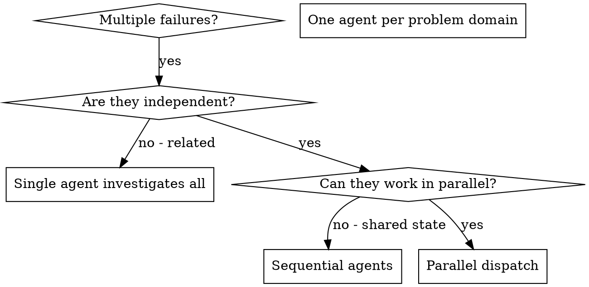

# Dispatching Parallel Agents

## Overview

You delegate tasks to specialised agents with an isolated context. By precisely crafting their instructions and context, you ensure they stay focused and succeed at their task. They should never inherit your session's context or history — you construct exactly what they need. This also preserves your own context for coordination work.

When you have multiple unrelated failures (different test files, different subsystems, different bugs), investigating them sequentially wastes time. Each investigation is independent and can happen in parallel.

**Core principle:** Dispatch one agent per independent problem domain. Let them work concurrently.

## When to Use



**Use when:**
- 3+ test files failing with different root causes
- Multiple subsystems broken independently
- Each problem can be understood without context from others
- No shared state between investigations

**Don't use when:**
- Failures are related (fix one might fix others)
- Need to understand the full system state
- Agents would interfere with each other

## The Pattern

### 1. Identify Independent Domains

Group failures by what's broken:
- File A tests: Tool approval flow
- File B tests: Batch completion behaviour
- File C tests: Abort functionality

Each domain is independent - fixing tool approval doesn't affect abort tests.

### 2. Create Focused Agent Tasks

Each agent gets:
- **Specific scope:** One test file or subsystem
- **Clear goal:** Make these tests pass
- **Constraints:** Don't change other code
- **Expected output:** Summary of what you found and fixed

### 3. Dispatch in Parallel

Dispatch all agents in a single message using `{{DISPATCH_AGENT_TOOL}}` so they run concurrently:

```
{{DISPATCH_AGENT_TOOL}}: "Fix agent-tool-abort.test.ts failures"
{{DISPATCH_AGENT_TOOL}}: "Fix batch-completion-behavior.test.ts failures"
{{DISPATCH_AGENT_TOOL}}: "Fix tool-approval-race-conditions.test.ts failures"
```

### 4. Review and Integrate

When agents return:
- Read each summary
- Verify fixes don't conflict
- Run a full test suite
- Integrate all changes

## Agent Prompt Structure

Good agent prompts are:
1. **Focused** - One clear problem domain
2. **Self-contained** - All context needed to understand the problem
3. **Specific about output** - What should the agent return?

```markdown
Fix the 3 failing tests in src/agents/agent-tool-abort.test.ts:

1. "should abort tool with partial output capture" - expects 'interrupted at' in a message
2. "should handle mixed completed and aborted tools" - fast tool aborted instead of completed
3. "should properly track pendingToolCount" - expects 3 results but gets 0

These are timing/race condition issues. Your task:

1. Read the test file and understand what each test verifies
2. Identify root cause - timing issues or actual bugs?
3. Fix by:
   - Replacing arbitrary timeouts with event-based waiting
   - Fixing bugs in abort implementation if found
   - Adjusting test expectations if testing changed behaviour

Do NOT just increase timeouts - find the real issue.

Return: Summary of what you found and what you fixed.
```

## Common Mistakes

**[INCORRECT] Too broad:** "Fix all the tests" - agent gets lost
**[CORRECT] Specific:** "Fix agent-tool-abort.test.ts" - focused scope

**[INCORRECT] No context:** "Fix the race condition" - agent doesn't know where
**[CORRECT] Context:** Paste the error messages and test names

**[INCORRECT] No constraints:** Agent might refactor everything
**[CORRECT] Constraints:** "Do NOT change production code" or "Fix tests only"

**[INCORRECT] Vague output:** "Fix it" - you don't know what changed
**[CORRECT] Specific:** "Return summary of root cause and changes"

## When NOT to Use

**Related failures:** Fixing one might fix others - investigate together first
**Need full context:** Understanding requires seeing the entire system
**Exploratory debugging:** You don't know what's broken yet
**Shared state:** Agents would interfere (editing same files, using same resources)

## Real Example from Session

**Scenario:** 6 test failures across 3 files after major refactoring

**Failures:**
- agent-tool-abort.test.ts: 3 failures (timing issues)
- batch-completion-behavior.test.ts: 2 failures (tools not executing)
- tool-approval-race-conditions.test.ts: 1 failure (execution count = 0)

**Decision:** Independent domains - abort logic separate from batch completion separate from race conditions

**Dispatch:**
```
Agent 1 → Fix agent-tool-abort.test.ts
Agent 2 → Fix batch-completion-behavior.test.ts
Agent 3 → Fix tool-approval-race-conditions.test.ts
```

**Results:**
- Agent 1: Replaced timeouts with event-based waiting
- Agent 2: Fixed the event structure bug (threadId in the wrong place)
- Agent 3: Added wait for async tool execution to complete

**Integration:** All fixes independent, no conflicts, full suite green

**Time saved:** 3 problems solved in parallel vs sequentially

## Key Benefits

1. **Parallelisation** - Multiple investigations happen simultaneously
2. **Focus** - Each agent has a narrow scope, less context to track
3. **Independence** - Agents don't interfere with each other
4. **Speed** - 3 problems solved in time of 1

## Verification

After agents return:
1. **Review each summary** - Understand what changed
2. **Check for conflicts** - Did agents edit the same code?
3. **Run full suite** - Verify all fixes work together
4. **Spot check** - Agents can make systematic errors

## Subagent Type Selection

When dispatching parallel agents, select specialised subagent types where possible. The same principle from subagent-driven-development applies here: generic agents produce generic work.

For each agent being dispatched:

1. What language, framework, or domain does the problem involve?
2. Is there a specialised subagent type that fits? (e.g. `typescript-pro` for TypeScript test failures, `python-pro` for Python issues, `debugger` for diagnostic work)
3. Use it via the `subagent_type` parameter on `{{DISPATCH_AGENT_TOOL}}`
4. Fall back to `general-purpose` only when no specialised type fits

When dispatching multiple agents in parallel, each can use a different specialised type based on its specific problem domain.
