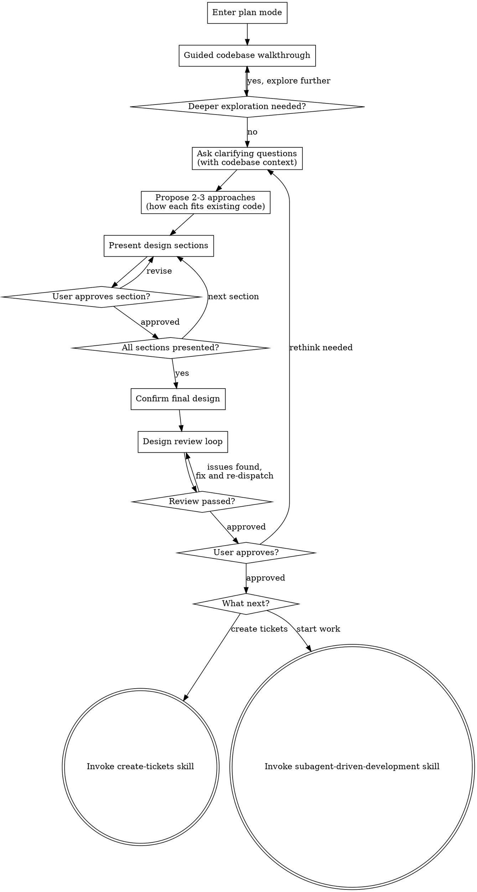

# Guided Brainstorming

Help turn ideas into fully formed designs while teaching the developer about the codebase. The same flow as brainstorming, but every phase actively explains what it finds, why things are the way they are, and how the design fits with existing patterns.

<HARD-GATE>
Do NOT invoke any implementation skill, write any code, scaffold any project, or take any implementation action until you have presented a design and the user has approved it. This applies to EVERY project regardless of perceived simplicity.
</HARD-GATE>

## How This Differs From Brainstorming

Regular brainstorming explores the codebase silently and focuses on reaching a design efficiently. Guided brainstorming assumes the developer is new to the codebase and needs to build a mental model as they go. The difference is in how you communicate, not in what you produce.

- **Show your working** - when you read files, explain what you found and why it matters
- **Connect the dots** - relate what you find to the user's goal: "This is relevant because..."
- **Name the patterns** - when the codebase follows a pattern, name it and explain it
- **Surface conventions** - don't assume the user knows how things are done here
- **Invite questions** - after explaining something, pause and ask if anything needs deeper exploration

The output is the same: a reviewed design that flows into either create-tickets or subagent-driven-development.

## Why Plan Mode

Plan mode is the native environment for guided brainstorming. It provides:

- **Read-only safety** - you can explore the codebase freely but cannot write code, create files, or take implementation actions. The hard gate enforces itself.
- **Iterative refinement** - the conversation IS the design medium. Each exchange refines the design with the user reviewing in real time.
- **No stale artefacts** - the design lives in the conversation context and flows directly into planning.

## Checklist

You MUST enter plan mode (use `{{ENTER_PLAN_TOOL}}`) before guided brainstorming.

You MUST create a task (using `{{TASK_TRACKER_TOOL}}`) for each of these items and complete them in order:

1. **Guided codebase walkthrough** - explore the project and present a structured overview of architecture, relevant subsystems, and conventions
2. **Ask clarifying questions** - one at a time, contextualised against what the codebase already does
3. **Propose 2-3 approaches** - with trade-offs explained in terms of how each fits with existing code
4. **Present design** - in sections scaled to their complexity, get user approval after each section
5. **Confirm final design** - summarise the agreed design in a structured message
6. **Design review loop** - dispatch design-reviewer subagent using `{{DISPATCH_AGENT_TOOL}}` against the summary; fix issues and re-dispatch until approved (max three iterations, then surface to human)
7. **User approves final design** - present the reviewed design summary, get explicit user approval
8. **Decide next step** - use `{{ASK_USER_TOOL}}` to ask what to do next (see Next Steps below)

## Process Flow



**The terminal states are create-tickets or subagent-driven-development.** After guided brainstorming, the only skills you invoke are create-tickets (to track work as tickets) or subagent-driven-development (to start building).

## The Process

### Phase 1: Guided Codebase Walkthrough

This replaces brainstorming's silent "explore project context" step. Read the codebase, then present what you found in a structured way.

**Architecture overview:**
- How the project is organised (directory structure, key entry points)
- The main patterns in use (e.g. MVC, event-driven, plugin architecture)
- How data flows through the system
- Key dependencies and why they're used

**Relevant subsystems:**
- Which parts of the codebase relate to what the user wants to build?
- How those parts work and interact
- Any existing code that does something similar to what's being proposed

**Conventions:**
- Naming conventions, file organisation patterns
- Testing approach (what framework, how tests are structured, where they live)
- Error handling patterns
- Configuration approach

After presenting each section, ask: "Does this make sense? Anything you'd like me to dig deeper into before we move on?"

If the user asks follow-up questions, explore further. This phase is not rushed - building the mental model is the point.

**Scope check:** Before moving to questions, assess scope the same way brainstorming does. If the request covers multiple independent subsystems, flag it and help decompose.

### Phase 2: Contextualised Clarifying Questions

Same rules as brainstorming (one question at a time, prefer multiple choice questions), but each question references what you found in the codebase:

- "The codebase currently handles authentication with middleware in `src/middleware/auth.ts`. Should the new feature integrate with that, or does it need its own auth approach?"
- "I see the project uses the repository pattern for data access (e.g. `UserRepository`, `OrderRepository`). Should we follow that for this feature?"
- "There are two existing patterns for API responses - one in `src/api/v1` uses direct returns, the newer `src/api/v2` uses a result wrapper. Which convention should this feature follow?"

The goal is to help the user make informed decisions by showing them what already exists.

### Phase 3: Contextualised Approach Proposals

Propose 2-3 approaches, but explain each in terms of how it fits with what's already there:

- "Option A follows the existing pattern in `src/services/` - this is the path of least resistance because..."
- "Option B introduces a new pattern. The codebase doesn't do this yet, but it would solve X. The trade-off is that it's inconsistent with existing code until other parts are migrated."
- "Option C reuses the existing `EventBus` infrastructure. This is the most integrated approach because..."

Lead with your recommendation and explain why it fits best given what you've shown the user about the codebase.

### Phase 4: Present Design

Same as brainstorming:
- Scale each section to its complexity
- Ask after each section whether it looks right so far
- Cover: architecture, components, data flow, error handling, testing
- Be ready to go back and clarify if something doesn't make sense

### Design for Isolation and Clarity

Same principles as brainstorming:
- Break into smaller units with one clear purpose and well-defined interfaces
- Each unit: what does it do, how do you use it, what does it depend on?
- Prefer smaller, focused files over large ones

### Working in Existing Codebases

Same principles as brainstorming:
- Follow existing patterns
- Where existing code has problems that affect the work, include targeted improvements
- Don't propose unrelated refactoring

## Confirming the Final Design

Once all design sections have been presented and approved individually:

- Summarise the complete agreed design in a single, structured message
- Include: goal, architecture, key components, interfaces, data flow, and anything else that emerged from the conversation

This summary becomes the input for both the design review loop and the next step (create-tickets or subagent-driven-development). It does not need to be written to a file because the conversation context carries it forward.

## Design Review Loop

After consolidating the design summary, dispatch a design-reviewer subagent to catch holistic issues that incremental section approval may miss. Provide the subagent with the full design summary text (never your session history).

The reviewer checks for:

| Category     | What to Look For                                                               |
|--------------|--------------------------------------------------------------------------------|
| Completeness | Gaps, undefined behaviour, missing sections                                    |
| Consistency  | Contradictions between sections, conflicting requirements                      |
| Clarity      | Requirements ambiguous enough to cause someone to build the wrong thing        |
| Scope        | Focused enough for a single plan, not covering multiple independent subsystems |
| YAGNI        | Unrequested features, over-engineering                                         |

**Calibration:** Only flag issues that would cause real problems during implementation planning. A contradiction, a missing component, or a requirement so ambiguous it could be interpreted two different ways are issues. Minor wording improvements, stylistic preferences, and "sections less detailed than others" are not.

**Process:**

1. Dispatch design-reviewer subagent using `{{DISPATCH_AGENT_TOOL}}` (use the same design-reviewer-prompt.md from brainstorming skill)
2. If issues are found: fix the design summary and re-dispatch
3. Repeat until approved (max three iterations, then surface to human for guidance)

After the review loop passes, present the final design summary to the user and get explicit approval before proceeding. If the user requests changes, make them and re-run the review loop.

## Next Steps

Once the user approves the reviewed design, use `{{ASK_USER_TOOL}}` to determine next steps. Do NOT ask as plain text.

```
{{ASK_USER_TOOL}}:
  question: "Would you like to create tickets for this work, or start implementation now?"
  header: "Next step"
  options:
    - label: "Create tickets"
      description: "Break the design into tracked tickets. Good when work isn't happening right now, needs tracking, or involves multiple people."
    - label: "Start implementation"
      description: "Begin building now using subagent-driven development."
  multiSelect: false
```

**Create tickets:** Use `{{INVOKE_SKILL_TOOL}}` to invoke the create-tickets skill. The full design is embedded in the epic body so that work-on-ticket can recover it in a future session.

**Start implementation:** Use `{{INVOKE_SKILL_TOOL}}` to invoke the subagent-driven-development skill. This decomposes the design into tasks and executes them with subagents.

Do NOT invoke any other skill. The only downstream skills are create-tickets or subagent-driven-development.

## Key Principles

- **Teach as you go** - every exploration produces an explanation, not just data
- **Show your working** - when you read code, tell the user what you found and why it matters
- **One question at a time** - don't overwhelm with multiple questions
- **Contextualise everything** - questions, proposals, and design sections all reference existing code
- **Invite deeper exploration** - after explaining something, ask if the user wants to know more
- **YAGNI ruthlessly** - remove unnecessary features from all designs
- **Explore alternatives** - always propose 2-3 approaches before settling
- **Incremental validation** - present design, get approval before moving on
- **Design in dialogue** - the conversation is the design medium, not a file
