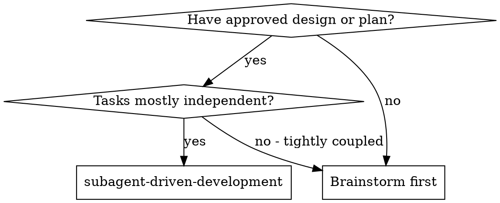
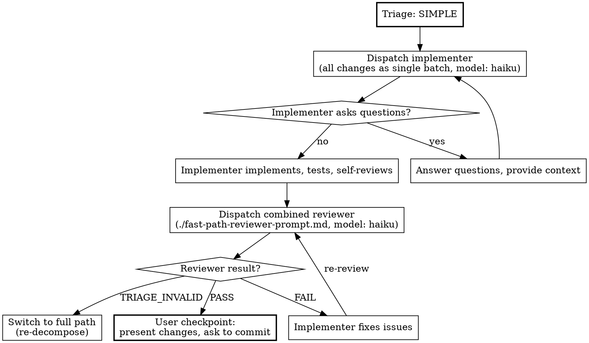
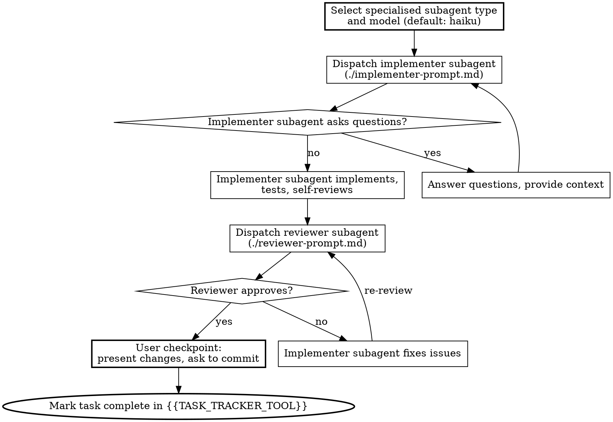

# Subagent-Driven Development

Implement an approved design by first triaging its complexity, then taking the appropriate path. Simple mechanical work (evidenced by strict binary criteria) gets a fast path: single implementation dispatch, single combined review. Complex work gets the full process: decompose into ordered tasks, execute sequentially with a fresh subagent per task, combined review per task, user checkpoint after each task.

**Why subagents:** You delegate tasks to specialised agents with an isolated context. By precisely crafting their instructions and context, you ensure they stay focused and succeed at their task. They should never inherit your session's context or history - you construct exactly what they need. This also preserves your own context for coordination work.

**Core principle:** Triage first, then either fast path (prove it's simple) or full path (decompose into ordered tasks, execute sequentially, combined review per task, user checkpoint) = right-sized process for the work

## Strict Rules

**Subagents MUST NOT commit.** The orchestrator owns all git operations. Subagents implement, test, and report back. The orchestrator presents changes to the user, who decides when to commit. This is non-negotiable.

**Worktrees are forbidden.** All work happens in the main working directory. Tasks run sequentially. Do not use `isolation: "worktree"` on any agent dispatch.

**Use the cheapest model that works.** Most implementation tasks are mechanical grunt work when the plan is well-specified. Default to `model: "haiku"` for implementers. Only escalate to a more capable model when the task genuinely requires it. Reviews should also use cheap models unless the code is architecturally complex. Save expensive models for coordination and judgment calls. See the Model Selection section for details.

## Subagent Type Selection

Before dispatching any subagent, check the available subagent types and select the most specific one that fits the task. Generic agents produce generic work. Specialised agents understand the domain, follow its conventions, and catch domain-specific issues that a general-purpose agent misses.

**The selection process for every dispatch:**

1. Look at the task: what language, framework, or domain does it involve?
2. Check the available subagent types for a match (e.g. `typescript-pro` for TypeScript, `react-specialist` for React components, `python-pro` for Python, `code-reviewer` for reviews)
3. If a specialised type matches, use it via the `subagent_type` parameter on `{{DISPATCH_AGENT_TOOL}}`
4. Fall back to `general-purpose` only when no specialised type fits

This applies to implementers and reviewers alike. A TypeScript task should be implemented by a TypeScript specialist and reviewed by a code reviewer specialist, not by two general-purpose agents.

**During task decomposition**, annotate each task with the recommended subagent type. This avoids re-evaluating the selection at dispatch time and makes the choice explicit and reviewable.

## When to Use



**Key advantages:**
- Handles both task decomposition and execution in one flow
- Fresh subagent per task (no context pollution)
- Combined review after each task: spec compliance and code quality in one pass
- User checkpoint after each task (review changes, decide whether to commit)
- Subagent can ask questions (before AND during work)

## Complexity Triage

Before decomposing work into tasks, assess whether the full process is warranted. **The default is always the full path.** The fast path is an optimisation for genuinely mechanical work where the per-task overhead adds no quality benefit.

### Why This Matters

The full process (per-task decomposition, each with combined review) is transformative for complex work. But for mechanical changes, like updating a version string across 8 files or fixing the same wording in 6 config files, the full process spends more tokens on coordination than on the actual work. Those files do not need 8 implementer dispatches and 8 reviews. They need one pass and one check.

The danger is that the fast path becomes an escape hatch from rigour. To prevent this, the triage uses strict binary criteria with mandatory evidence. You must prove the work is simple. You cannot assume it.

### Triage Criteria

**ALL** the following must be true for the fast path. A single failure means a full path, no exceptions.

| #   | Criterion                    | Definition                                                                             | Fails if                                                                                                    |
| --- | ---------------------------- | ----------------------------a---------------------------------------------------------- | ----------------------------------------------------------------------------------------------------------- |
| 1   | **Uniform change type**      | Every change is the same kind of edit applied across locations                         | Changes mix different concerns (e.g., docs + feature code, config + new logic)                              |
| 2   | **No new logic**             | Zero new functions, classes, conditionals, loops, error handling, or business rules    | Any new control flow or callable unit is introduced                                                         |
| 3   | **No new interfaces**        | No new exports, API endpoints, contracts, events, or public surface area               | Any new public-facing surface is created                                                                    |
| 4   | **Deterministic from spec**  | The correct change at each location is fully specified with no room for interpretation | Any change requires a design decision, judgment call, or contextual understanding beyond the immediate edit |
| 5   | **Independently verifiable** | Each change can be verified by reading it in isolation                                 | Correctness of one change depends on another change in a different file                                     |
| 6   | **Small total delta**        | Under ~50 lines of meaningful content change across all files                          | More than ~50 lines of substantive change                                                                   |

### Presenting the Evidence

Present the triage table before proceeding on either path. This is mandatory. The user needs to see the reasoning and can override the classification.

Format:

```
Complexity Triage

| # | Criterion | Evidence | Pass |
|---|-----------|----------|------|
| 1 | Uniform change type | [specific observation] | Y/N |
| 2 | No new logic | [specific observation] | Y/N |
| 3 | No new interfaces | [specific observation] | Y/N |
| 4 | Deterministic from spec | [specific observation] | Y/N |
| 5 | Independently verifiable | [specific observation] | Y/N |
| 6 | Small total delta | [line count estimate with method] | Y/N |

Classification: SIMPLE / COMPLEX
Path: Fast / Full
Justification: [one sentence]
```

### Evidence Standards

The evidence column must contain specific observations from the design, not restated criteria.

**These cause the criterion to fail (insufficient evidence):**
- "Changes are uniform" - restates the criterion, says nothing specific
- "No significant new logic" - qualifier ("significant") reveals ambiguity
- "Scope is small" - no numbers, no reasoning

**These are acceptable evidence:**
- "All 6 files: replace version string '2.3.0' with '2.4.0' in the module docstring header"
- "Zero new functions, conditionals, or loops; each change is a string literal replacement"
- "~18 lines total: 6 files x 3 lines each (version, date, changelog link)"

If a criterion needs qualifying language ("mostly", "generally", "essentially", "largely", "primarily"), it fails. The fast path is for work that is unambiguously simple.

### Triage Override

If during fast-path implementation or review it becomes clear the work is more complex than assessed, stop the fast path and switch to full. The combined reviewer can trigger this by reporting TRIAGE_INVALID. The sunk cost of the fast-path attempt is negligible compared to the cost of poorly reviewed complex work.

## Fast Path

When triage classifies work as SIMPLE, the process collapses to two subagent dispatches total.

### Process

1. **Single implementation dispatch**: One subagent receives all changes as a batch. Use the standard implementer prompt (`./implementer-prompt.md`) with the task description covering the full scope. Select the subagent type as normal. Use `model: "haiku"` - if work is simple enough for the fast path, it is simple enough for the cheapest model.

2. **Single combined review**: One reviewer checks spec compliance and code quality in a single pass (`./fast-path-reviewer-prompt.md`). This is not a weaker review. It covers everything the full-path review covers, combined because the small scope makes separation unnecessary overhead. Use `model: "haiku"` for the reviewer.

3. **User checkpoint**: Present the changes to the user for review. Ask whether to commit.

If the reviewer finds issues, the implementer fixes them and the reviewer reviews again. Same fix-and-re-review loop as the full path.

If the reviewer reports TRIAGE_INVALID, stop and switch to the full path. Re-decompose the work using the full path process below.

### Fast Path Flow



## Task Decomposition (Full Path)

When complexity triage classifies work as COMPLEX (the default), decompose the design into implementable tasks before dispatching subagents. The design from brainstorming (or an existing plan file) is the input.

### File Structure

Map out which files will be created or modified and what each one is responsible for. This locks in the decomposition decisions before any code is written.

- Each file should have one clear responsibility with a well-defined interface
- Prefer smaller, focused files over large ones that do too much
- In existing codebases, follow established patterns
- Files that change together should live together

### Task Granularity

Each task should be a self-contained unit of work that produces working, testable code:

- Touches a focused set of files (ideally 1-3)
- Has clear acceptance criteria derivable from the design
- Can be verified independently

Within each task, steps should follow TDD: write the failing test, run it, implement the minimal code, run tests. This level of detail is communicated to the implementer subagent, not tracked by the controller.

### Task Ordering

Order tasks to respect dependencies:

1. Foundation/infrastructure first
2. Core features next
3. Integration after dependencies
4. Polish/cleanup last

Tasks execute sequentially in this order. If two tasks have no dependency between them, their relative order does not matter, but they still run one at a time.

### Output

The decomposition produces a {{TASK_TRACKER_TOOL}} with all tasks. Each task entry includes:

- Task name and description
- Recommended subagent type (e.g. `typescript-pro`, `python-pro`, `react-specialist`)
- Recommended model (default `haiku`, escalate only with justification)
- Files to create or modify (exact paths)
- Acceptance criteria
- Dependencies on other tasks
- Scene-setting context (where this fits in the overall design)

## The Process (Full Path)

Execute tasks sequentially. Each task follows the same pipeline: implement, review, user checkpoint.

### Per-Task Pipeline



### User Checkpoint

After a task's review passes, the orchestrator **must** pause and present the work to the user:

1. Summarise what was implemented and what the reviewer found
2. Show a `git diff` of the uncommitted changes
3. Ask the user: "Ready to commit this, or would you like to adjust anything first?"
4. Only commit when the user confirms. The user may want to review, tweak, or reject the changes.
5. After committing (or if the user defers the commit), proceed to the next task

This checkpoint exists because the user owns the repository. Automated commits without review remove the user's ability to catch issues that automated review missed, or to adjust the approach before it compounds across subsequent tasks.

## Model Selection

Use the cheapest model that can handle each role. This is not a suggestion, it is a cost and speed discipline.

**Default to `model: "haiku"` for all subagent dispatches.** Escalate only when you have specific evidence the task requires more capability.

| Role | Default Model | Escalate to | Escalation trigger |
|---|---|---|---|
| Implementer (clear spec, 1-3 files) | `haiku` | `sonnet` | Task failed with haiku, or task requires multi-file integration reasoning |
| Implementer (integration, judgment) | `sonnet` | inherited | Multi-file coordination, pattern matching, debugging |
| Reviewer (standard) | `haiku` | `sonnet` | Architecturally complex code requiring deep reasoning |
| Fix subagent | `haiku` | `sonnet` | Fix requires understanding beyond the immediate issue |

**Task complexity signals:**
- Touches 1-2 files with a complete spec = `haiku`
- Touches multiple files with integration concerns = `sonnet`
- Requires design judgment or broad codebase understanding = inherited (most capable)

**Never pre-escalate.** Start with `haiku`. If it fails or produces poor results, re-dispatch with `sonnet`. The cost of one failed cheap attempt is less than always using expensive models.

## Handling Implementer Status

Implementer subagents report one of four statuses. Handle each appropriately:

**DONE:** Proceed to combined review.

**DONE_WITH_CONCERNS:** The implementer completed the work but flagged doubts. Read the concerns before proceeding. If the concerns are about correctness or scope, address them before review. If they're observations (e.g. "this file is getting large"), note them and proceed to review.

**NEEDS_CONTEXT:** The implementer needs information that wasn't provided. Provide the missing context and re-dispatch.

**BLOCKED:** The implementer cannot complete the task. Assess the blocker:
1. If it's a context problem, provide more context and re-dispatch with the same model
2. If the task requires more reasoning, re-dispatch with a more capable model
3. If the task is too large, break it into smaller pieces
4. If the plan itself is wrong, escalate to the human

**Never** ignore an escalation or force the same model to retry without changes. If the implementer said it's stuck, something needs to change.

## Prompt Templates

- `./implementer-prompt.md` - Dispatch implementer subagent (both paths)
- `./reviewer-prompt.md` - Dispatch combined reviewer subagent (full path)
- `./fast-path-reviewer-prompt.md` - Dispatch combined reviewer subagent (fast path)

## Example Workflows

### Fast Path Example

```
You: I'm implementing the design for updating copyright headers across the codebase.

Complexity Triage

| # | Criterion | Evidence | Pass |
|---|-----------|----------|------|
| 1 | Uniform change type | All 8 files: replace "Copyright 2025" with "Copyright 2026" in file header | Y |
| 2 | No new logic | Zero new functions or control flow; each change is a string literal replacement | Y |
| 3 | No new interfaces | No new exports, APIs, or contracts | Y |
| 4 | Deterministic from spec | Design lists exact files and exact old/new strings | Y |
| 5 | Independently verifiable | Each file's header change is self-contained | Y |
| 6 | Small total delta | ~8 lines total (1 line per file x 8 files) | Y |

Classification: SIMPLE
Path: Fast
Justification: Identical string replacement across 8 independent files with zero logic changes.

[Dispatch single implementer (model: haiku) with all 8 files as one batch]

Implementer:
  - Updated copyright year in all 8 files
  - Self-review: All changes are consistent string replacements

[Dispatch combined reviewer (model: haiku)]

Combined reviewer: [PASS] All 8 files correctly updated. Changes match spec exactly,
no extra modifications, consistent with surrounding code style.

[Present diff to user]
Here are the changes - 8 files with updated copyright headers. Ready to commit?

User: Looks good, commit it.

[Commit changes]

Done!
```

### Full Path Example

```
You: I'm using Subagent-Driven Development to implement this design.

[Decompose design into tasks: map file structure, define 5 tasks with acceptance criteria, order by dependencies]
[Create {{TASK_TRACKER_TOOL}} with all tasks, each annotated with subagent type and model: haiku]

Task 1 (model: haiku):

[Dispatch implementer]

Implementer: "Before I begin - should the hook be installed at user or system level?"

You: "User level (~/.config/hooks/)"

Implementer: "Got it. Implementing now..."
[Later] Implementer:
  - Implemented install-hook command
  - Added tests, 5/5 passing
  - Self-review: Found I missed --force flag, added it

[Dispatch reviewer]
Reviewer: [PASS] Spec compliant, code quality good. Clean implementation, good test coverage.

[Present diff to user]
Task 1 complete: install-hook command with --force flag. 5 tests passing.
Here's the diff - ready to commit?

User: Yes, commit.

[Commit, mark Task 1 complete]

Task 2 (model: haiku):

[Dispatch implementer]

Implementer:
  - Added verify/repair modes
  - 8/8 tests passing
  - Self-review: All good

[Dispatch reviewer]
Reviewer: [FAIL] Issues:
  - Missing: Progress reporting (spec says "report every 100 items")
  - Extra: Added --json flag (not requested)
  - Magic number (100) should be a named constant

[Dispatch fix subagent (model: haiku)]
Implementer: Removed --json flag, added progress reporting with PROGRESS_INTERVAL constant

[Reviewer reviews again]
Reviewer: [PASS] Spec compliant now, quality good.

[Present diff to user]
Task 2 complete: verify/repair modes with progress reporting. 8 tests passing.
The reviewer caught a missing requirement and an extra flag on first pass, both fixed.
Here's the diff - ready to commit?

User: Yes.

[Commit, mark Task 2 complete]

Tasks 3-5...

Done!
```

## Advantages

**vs. Manual execution:**
- Subagents follow TDD naturally
- Fresh context per task (no confusion)
- Subagent can ask questions (before AND during work)
- User reviews each chunk before it's committed

**Efficiency gains:**
- No file reading overhead (controller provides full text)
- Controller curates exactly what context is needed
- Design-to-execution in one flow (no intermediate handoff)
- Subagent gets complete information upfront
- Questions surfaced before work begins (not after)
- Cheap models for grunt work keeps cost down

**Quality gates:**
- Self-review catches issues before handoff
- Combined review: spec compliance and code quality in one pass
- Review loops to ensure fixes actually work
- User checkpoint after each task
- Spec compliance prevents over/under-building
- Code quality ensures the implementation is well-built

**Cost:**
- More subagent invocations (implementer + reviewer per task)
- Controller does more prep work (extracting all tasks upfront)
- Review loops add iterations
- But cheap models and combined review keep token spend reasonable
- Catches issues early (cheaper than debugging later)

## Red Flags

**Never:**
- Use worktrees (`isolation: "worktree"` is forbidden)
- Let subagents commit (the orchestrator owns all git operations)
- Skip reviews
- Proceed with unfixed issues
- Commit without user approval (always checkpoint first)
- Use expensive models without justification (default to `haiku`)
- Make a subagent discover context on its own (provide full text instead)
- Skip scene-setting context (subagent needs to understand where a task fits)
- Ignore subagent questions (answer before letting them proceed)
- Accept "close enough" on spec compliance (reviewer found issues = not done)
- Skip review loops (reviewer found issues = implementer fixes = review again)
- Let implementer self-review replace the actual review (both are needed)
- Move to the next task while a review has open issues
- Allow subagents to use `sudo` or elevated privileges

**If subagent asks questions:**
- Answer clearly and completely
- Provide additional context if needed
- Don't rush them into implementation

**If the reviewer finds issues:**
- Implementer (same subagent type) fixes them
- Reviewer reviews again
- Repeat until approved
- Don't skip the re-review

**If subagent fails task:**
- Re-dispatch with a more capable model before anything else
- If that fails, dispatch fix subagent with specific instructions
- Don't try to fix manually (context pollution)

**Complexity triage:**
- Never classify work as SIMPLE without presenting the full evidence table
- Never use qualifying language in evidence ("mostly", "largely", "primarily", "essentially")
- Never skip the combined review on the fast path
- Never continue the fast path after a TRIAGE_INVALID from the reviewer
- Never use the fast path as a default. COMPLEX is the default. SIMPLE must be proven
- Never split genuinely simple work into the full path to look thorough. That wastes tokens without adding quality

## Integration

**Required workflow skills:**
- **brainstorming** or **guided-brainstorming** - Creates the design this skill implements
- **work-on-ticket** - Recovers design context from tickets in new sessions and feeds it into this skill
- **requesting-code-review** - Code review template for reviewer subagents

**Subagents should use:**
- **test-driven-development** - Subagents follow TDD for each task
