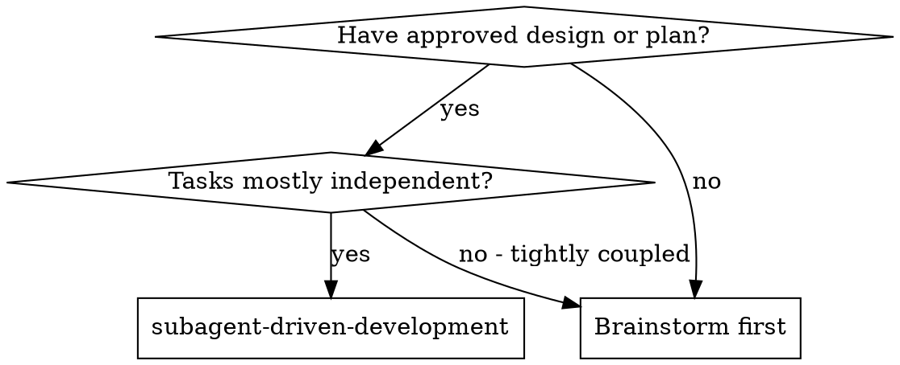
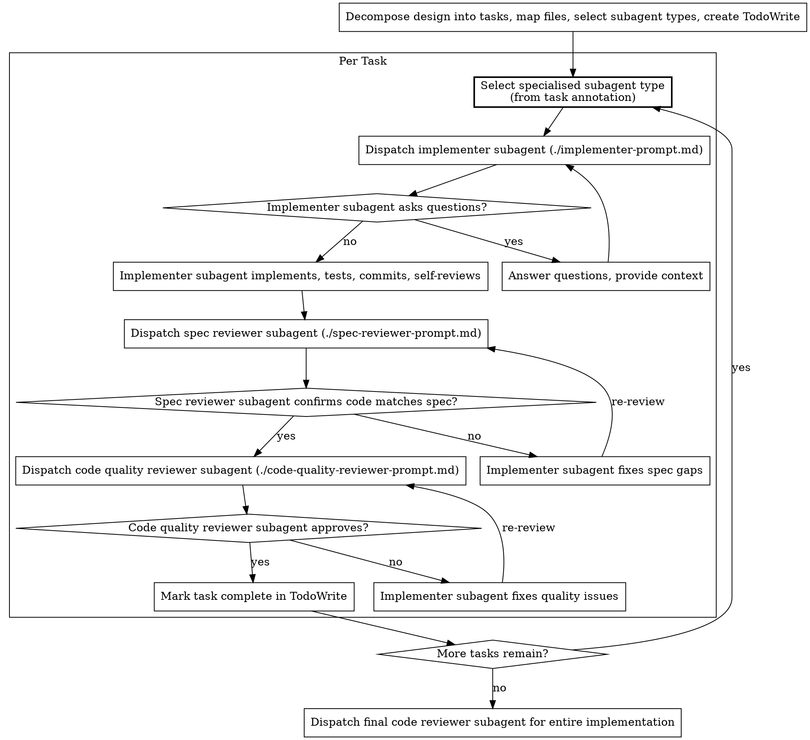

# Subagent-Driven Development

Decompose a design into implementable tasks, then execute each by dispatching a fresh subagent per task with a two-stage review after each: spec compliance review first, then code quality review.

**Why subagents:** You delegate tasks to specialised agents with an isolated context. By precisely crafting their instructions and context, you ensure they stay focused and succeed at their task. They should never inherit your session's context or history — you construct exactly what they need. This also preserves your own context for coordination work.

**Core principle:** Design in, decompose into tasks, fresh subagent per task, two-stage review = high quality, fast iteration

## Subagent Type Selection

Before dispatching any subagent, check the available subagent types and select the most specific one that fits the task. Generic agents produce generic work. Specialised agents understand the domain, follow its conventions, and catch domain-specific issues that a general-purpose agent misses.

**The selection process for every dispatch:**

1. Look at the task: what language, framework, or domain does it involve?
2. Check the available subagent types for a match (e.g. `typescript-pro` for TypeScript, `react-specialist` for React components, `python-pro` for Python, `code-reviewer` for reviews)
3. If a specialised type matches, use it via the `subagent_type` parameter
4. Fall back to `general-purpose` only when no specialised type fits

This applies to implementers, spec reviewers, and code quality reviewers alike. A TypeScript task should be implemented by a TypeScript specialist, and reviewed by a code reviewer specialist, not by three general-purpose agents.

**During task decomposition**, annotate each task with the recommended subagent type. This avoids re-evaluating the selection at dispatch time and makes the choice explicit and reviewable.

## When to Use



**Key advantages:**
- Handles both task decomposition and execution in one flow
- Fresh subagent per task (no context pollution)
- Two-stage review after each task: spec compliance first, then code quality
- Faster iteration (no human-in-loop between tasks)

## Task Decomposition

Before dispatching subagents, decompose the design into implementable tasks. The design from brainstorming (or an existing plan file) is the input.

### File Structure

Map out which files will be created or modified and what each one is responsible for. This locks in the decomposition decisions before any code is written.

- Each file should have one clear responsibility with a well-defined interface
- Prefer smaller, focused files over large ones that do too much
- In existing codebases, follow established patterns
- Files that change together should live together

### Task Granularity

Each task should be a self-contained unit of work that produces working, testable code:

- Touches a focused set of files (ideally 1-3)
- Has clear acceptance criteria derivable from the design
- Can be verified independently
- Results in a commit

Within each task, steps should follow TDD: write the failing test, run it, implement the minimal code, run tests, commit. This level of detail is communicated to the implementer subagent, not tracked by the controller.

### Task Ordering

Order tasks to respect dependencies:

1. Foundation/infrastructure first
2. Core features next
3. Integration after dependencies
4. Polish/cleanup last

### Output

The decomposition produces a TodoWrite with all tasks. Each task entry includes:

- Task name and description
- Recommended subagent type (e.g. `typescript-pro`, `python-pro`, `react-specialist`)
- Files to create or modify (exact paths)
- Acceptance criteria
- Dependencies on other tasks
- Scene-setting context (where this fits in the overall design)

## The Process



## Model Selection

Use the least powerful model that can handle each role to conserve cost and increase speed.

**Mechanical implementation tasks** (isolated functions, clear specs, 1-2 files): use a fast, inexpensive model. Most implementation tasks are mechanical when the plan is well-specified.

**Integration and judgment tasks** (multi-file coordination, pattern matching, debugging): use a standard model.

**Architecture, design, and review tasks**: use the most capable available model.

**Task complexity signals:**
- Touches 1-2 files with a complete spec → inexpensive model
- Touches multiple files with integration concerns → standard model
- Requires design judgment or broad codebase understanding → most capable model

## Handling Implementer Status

Implementer subagents report one of four statuses. Handle each appropriately:

**DONE:** Proceed to spec compliance review.

**DONE_WITH_CONCERNS:** The implementer completed the work but flagged doubts. Read the concerns before proceeding. If the concerns are about correctness or scope, address them before review. If they're observations (e.g. "this file is getting large"), note them and proceed to review.

**NEEDS_CONTEXT:** The implementer needs information that wasn't provided. Provide the missing context and re-dispatch.

**BLOCKED:** The implementer cannot complete the task. Assess the blocker:
1. If it's a context problem, provide more context and re-dispatch with the same model
2. If the task requires more reasoning, re-dispatch with a more capable model
3. If the task is too large, break it into smaller pieces
4. If the plan itself is wrong, escalate to the human

**Never** ignore an escalation or force the same model to retry without changes. If the implementer said it's stuck, something needs to change.

## Prompt Templates

- `./implementer-prompt.md` - Dispatch implementer subagent
- `./spec-reviewer-prompt.md` - Dispatch spec compliance reviewer subagent
- `./code-quality-reviewer-prompt.md` - Dispatch code quality reviewer subagent

## Example Workflow

```
You: I'm using Subagent-Driven Development to implement this design.

[Decompose design into tasks: map file structure, define 5 tasks with acceptance criteria]
[Create TodoWrite with all tasks]

Task 1: Hook installation script

[Dispatch implementation subagent with full task text + context]

Implementer: "Before I begin - should the hook be installed at user or system level?"

You: "User level (~/.config/hooks/)"

Implementer: "Got it. Implementing now..."
[Later] Implementer:
  - Implemented install-hook command
  - Added tests, 5/5 passing
  - Self-review: Found I missed --force flag, added it
  - Committed

[Dispatch spec compliance reviewer]
Spec reviewer: [PASS] Spec compliant - all requirements met, nothing extra

[Get git SHAs, dispatch code quality reviewer]
Code reviewer: Strengths: Good test coverage, clean. Issues: None. Approved.

[Mark Task 1 complete]

Task 2: Recovery modes

[Dispatch implementation subagent with full task text + context]

Implementer: [No questions, proceeds]
Implementer:
  - Added verify/repair modes
  - 8/8 tests passing
  - Self-review: All good
  - Committed

[Dispatch spec compliance reviewer]
Spec reviewer: [FAIL] Issues:
  - Missing: Progress reporting (spec says "report every 100 items")
  - Extra: Added --json flag (not requested)

[Implementer fixes issues]
Implementer: Removed --json flag, added progress reporting

[Spec reviewer reviews again]
Spec reviewer: [PASS] Spec compliant now

[Dispatch code quality reviewer]
Code reviewer: Strengths: Solid. Issues (Important): Magic number (100)

[Implementer fixes]
Implementer: Extracted PROGRESS_INTERVAL constant

[Code reviewer reviews again]
Code reviewer: [PASS] Approved

[Mark Task 2 complete]

...

[After all tasks]
[Dispatch final code-reviewer]
Final reviewer: All requirements met, ready to merge

Done!
```

## Advantages

**vs. Manual execution:**
- Subagents follow TDD naturally
- Fresh context per task (no confusion)
- Parallel-safe (subagents don't interfere)
- Subagent can ask questions (before AND during work)

**Efficiency gains:**
- No file reading overhead (controller provides full text)
- Controller curates exactly what context is needed
- Design-to-execution in one flow (no intermediate handoff)
- Subagent gets complete information upfront
- Questions surfaced before work begins (not after)

**Quality gates:**
- Self-review catches issues before handoff
- Two-stage review: spec compliance, then code quality
- Review loops to ensure fixes actually work
- Spec compliance prevents over/under-building
- Code quality ensures the implementation is well-built

**Cost:**
- More subagent invocations (implementer + 2 reviewers per task)
- Controller does more prep work (extracting all tasks upfront)
- Review loops add iterations
- But catches issues early (cheaper than debugging later)

## Red Flags

**Never:**
- Skip reviews (spec compliance OR code quality)
- Proceed with unfixed issues
- Dispatch multiple implementation subagents in parallel (conflicts)
- Make subagent discover context on its own (provide full text instead)
- Skip scene-setting context (subagent needs to understand where a task fits)
- Ignore subagent questions (answer before letting them proceed)
- Accept "close enough" on spec compliance (spec reviewer found issues = not done)
- Skip review loops (reviewer found issues = implementer fixes = review again)
- Let implementer self-review replace the actual review (both are needed)
- **Start code quality review before spec compliance is correct** (wrong order)
- Move to the next task while either review has open issues

**If subagent asks questions:**
- Answer clearly and completely
- Provide additional context if needed
- Don't rush them into implementation

**If the reviewer finds issues:**
- Implementer (same subagent) fixes them
- Reviewer reviews again
- Repeat until approved
- Don't skip the re-review

**If subagent fails task:**
- Dispatch fix subagent with specific instructions
- Don't try to fix manually (context pollution)

## Integration

**Required workflow skills:**
- **brainstorming** or **guided-brainstorming** - Creates the design this skill implements
- **work-on-ticket** - Recovers design context from tickets in new sessions and feeds it into this skill
- **requesting-code-review** - Code review template for reviewer subagents

**Subagents should use:**
- **test-driven-development** - Subagents follow TDD for each task

