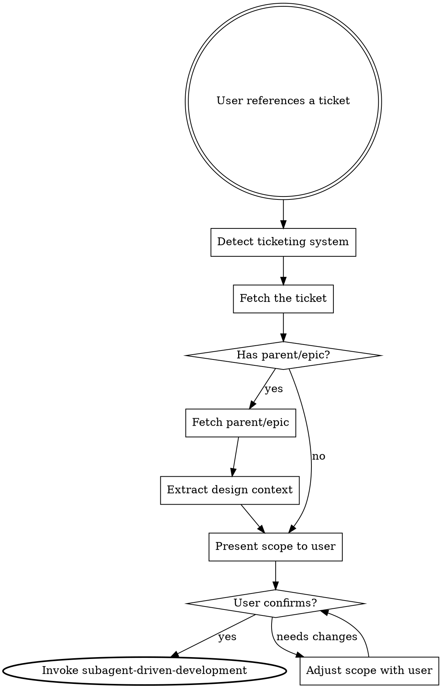

# Work on Ticket

Pick up a ticket from the ticketing system and implement it with full design context, bridging the gap between create-tickets and subagent-driven-development across session boundaries.

**Announce at the start:** "I'm using the work-on-ticket skill to fetch this ticket and recover the design context."

## When to Use

Use this skill when a user references a specific ticket to work on (e.g. "work on #42", "pick up PROJ-123", "implement issue 7"). This is the re-entry point for work that was planned via brainstorming and tracked via create-tickets in a previous session.



## Checklist

You MUST complete these steps in order:

1. **Detect ticketing system** - identify where the ticket lives
2. **Fetch the ticket** - retrieve the full ticket content
3. **Fetch design context** - if the ticket has a parent/epic, fetch it to recover the design summary
4. **Explore the codebase** - check the current state of files relevant to the ticket
5. **Present scope and context** - show the user what you understand the ticket requires, including the design context from the epic
6. **User confirms scope** - use `{{ASK_USER_TOOL}}` to get explicit approval (see Presenting Scope below)
7. **Invoke subagent-driven-development** - use the `{{INVOKE_SKILL_TOOL}}` tool to invoke `subagent-driven-development`, passing the ticket spec and design context as the approved design (see Passing to Subagent-Driven Development below)

## Detection

Identify the ticketing system using the same approach as create-tickets:

### 1. Available MCP Tools

| MCP Tool Pattern                    | System        | Fetch Tool                          |
|-------------------------------------|---------------|-------------------------------------|
| `mcp__*Atlassian*__getJiraIssue`    | Jira          | `getJiraIssue`                      |
| `mcp__*github*__issue_read`         | GitHub Issues | `issue_read`                        |
| Linear MCP tools                    | Linear        | Linear read tools                   |
| GitLab MCP tools                    | GitLab Issues | GitLab read tools                   |

### 2. Git Remote (fallback)

```bash
git remote get-url origin
```

### 3. CLI Fallback

If MCP tools are unavailable:

| System        | Command                                                                  |
|---------------|--------------------------------------------------------------------------|
| GitHub Issues | `gh issue view <number> --json title,body,labels,milestone,projectItems` |
| GitLab Issues | `glab issue view <number>`                                               |

## Fetching the Ticket

Retrieve the full ticket content including:

- Title
- Description/body
- Labels/tags
- Status
- Parent/epic relationship (critical for design context recovery)
- Sub-tickets/child issues (to understand scope boundaries)
- Linked tickets (to understand dependencies)

### Finding the Parent/Epic

The parent relationship varies by system:

**GitHub Issues:** Check for sub-issue relationships. Use `issue_read` to check if the issue has a parent. If available, the parent issue number will be in the response. Also, check the issue body for "Part of #N" or "Epic: #N" references.

**Jira:** Use `getJiraIssue` and check the `parent` or `epic` field. Jira natively supports epic-to-story relationships.

**Linear:** Check the `parent` field on the issue.

**GitLab:** Check for epic associations or parent issue references.

## Recovering Design Context

The parent/epic ticket contains the full design summary embedded by create-tickets. This is the architectural context that informed the ticket decomposition.

When you fetch the epic body, look for the design summary section. The create-tickets skill writes this under a "## Design" heading in the epic body.

**If the epic has a design section:** Extract it. This becomes the design context for implementation, it gives the implementer the full picture of what is being built and where this ticket fits.

**If the epic has no design section:** The tickets may have been created manually or by an older version of create-tickets. In this case:
- Read the epic description for whatever context is available
- Check sibling tickets to understand the broader scope
- Present what you have to the user and ask if they can provide additional context
- Proceed with what is available rather than blocking

## Presenting Scope

Before invoking subagent-driven-development, present the user with a structured summary:

**Ticket:** [title and reference]

**Design context** (from epic): [the design summary, or a note that none was found]

**This ticket's scope:**
- What to build (from the ticket description)
- Acceptance criteria (from the ticket)
- Dependencies (from linked tickets, what must exist before this work)
- What is explicitly out of scope (from sibling tickets, things that belong to other tickets)

**Current codebase state:** [relevant observations from exploring the code]

After presenting the summary, use the `{{ASK_USER_TOOL}}` tool to get a structured confirmation. Do NOT ask as plain text.

```
{{ASK_USER_TOOL}}:
  question: "Does this scope look right for implementation?"
  header: "Scope"
  options:
    - label: "Looks good, proceed"
      description: "The scope, design context, and acceptance criteria are correct. Start implementation."
    - label: "Adjust scope"
      description: "Something needs changing before implementation begins."
    - label: "Need more context"
      description: "Fetch additional tickets or explore the codebase further before deciding."
  multiSelect: false
```

If the user selects "Adjust scope" or "Need more context", address their feedback and re-present with `{{ASK_USER_TOOL}}` again. Only proceed to step 7 after the user selects "Looks good, proceed".

## Passing to Subagent-Driven Development

Once the user confirms (by selecting "Looks good, proceed"), you MUST use the `{{INVOKE_SKILL_TOOL}}` tool to invoke the `subagent-driven-development` skill. Do NOT attempt to follow the subagent-driven-development process yourself without loading the skill first.

```
{{INVOKE_SKILL_TOOL}}:
  skill: "subagent-driven-development"
```

Before invoking the skill, construct the design input in your message context by combining:

1. **The design context** from the epic (the architectural vision)
2. **The ticket scope** (what specifically this ticket delivers)
3. **The acceptance criteria** (when this ticket is done)
4. **Codebase observations** (current state of relevant files)

This combined context serves as the "approved design" that subagent-driven-development expects. The ticket's acceptance criteria become the spec that the spec reviewer checks against.

**Critical:** The transition to subagent-driven-development is a `{{INVOKE_SKILL_TOOL}}` tool invocation, not a conceptual handoff. If you skip this step, the downstream skill's full instructions will not be loaded and implementation quality will suffer.

## Handling Multiple Tickets

If the user wants to work on multiple tickets:

- Work on them one at a time, in dependency order
- Complete one ticket (through the full subagent-driven-development cycle including reviews) before starting the next
- If tickets are truly independent and the user wants parallel work, suggest separate sessions

## Edge Cases

**Ticket already partially implemented:** Check git history and current code state. Present what exists to the user. Adjust the scope to cover only remaining work.

**Ticket depends on unfinished work:** Flag the dependency. Ask the user whether to work on the dependency first or proceed with stubs/interfaces.

**Ticket description is vague:** Use the epic's design context to fill in gaps. If still unclear, ask the user targeted questions before proceeding. Do not guess at requirements.

**No ticketing system available:** If the user provides a ticket reference but no system is detected, ask them to paste the ticket content directly. Proceed with whatever context they provide.

## Integration

**Upstream skills:**
- **brainstorming** - Creates the design that create-tickets embeds in the epic
- **create-tickets** - Creates the tickets this skill picks up, embeds design in the epic

**Downstream skills:**
- **subagent-driven-development** - Implements the ticket with the recovered design context

**Completing the workflow loop:**

```
brainstorming -> create-tickets -> [session boundary] -> work-on-ticket -> subagent-driven-development
```
